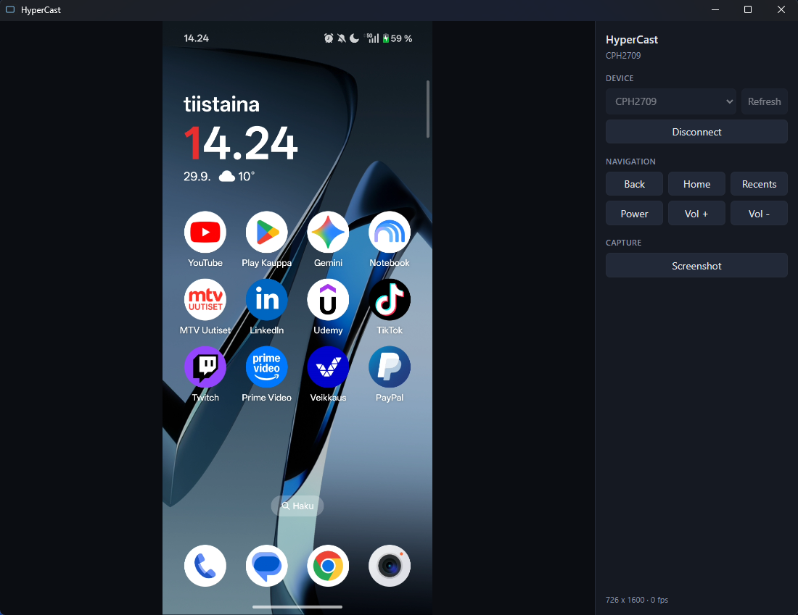

HyperCast is a lightweight desktop application designed for zero-lag Android screen mirroring.

## Screenshot

## Features

- **Ultra-low latency**: H.264 sent straight to the UI and decoded with WebCodecs
- **Live mirror**: H.264 stream over USB (ADB), no app to install on the phone
- **Navigation**: back, home, recents, power, Volume up/down
- **Two-pane layout**: mirror on the left, controls on the right
- **Screenshot**: full-resolution PNG saved via file dialog
- **Input**: control the phone with mouse and keyboard

## Planned updates

- **Mouse wheel**: scroll inside Android apps from the mirror.
- **Copy from phone to PC**: copy text from Android to computer.
- **Phone audio on the PC**: play device audio through the computer.

## Built With

| Layer | Technologies |
|-------|----------------|
| **Shell** | [Tauri 2](https://v2.tauri.app/), [Rust](https://www.rust-lang.org/), [Tokio](https://tokio.rs/) |
| **UI** | [Svelte 5](https://svelte.dev/), [TypeScript](https://www.typescriptlang.org/), [Vite](https://vite.dev/) |
| **WebView** | [WebView2](https://developer.microsoft.com/microsoft-edge/webview2/) |
| **Video** | [WebCodecs](https://developer.mozilla.org/en-US/docs/Web/API/WebCodecs_API) |
| **Capture** | [scrcpy-server 4.1](https://github.com/Genymobile/scrcpy) |

## Download

Get the latest Windows installer from **[Releases](https://github.com/vpakarinen2/hypercast/releases)** (`HyperCast_*_x64-setup.exe`).

*Note: Windows may block the installer (SmartScreen or Defender) because the app is not signed.*

## Quick Start

1. **Phone:** Settings → About phone → tap **Build number** 7 times → enable **USB debugging** in Developer options.
2. Connect USB, unlock the phone, tap **Allow** on the USB debugging prompt.
3. Install and open **HyperCast** → **Refresh** → select your device → **Connect**.

## Author

Ville Pakarinen (@vpakarinen2)
